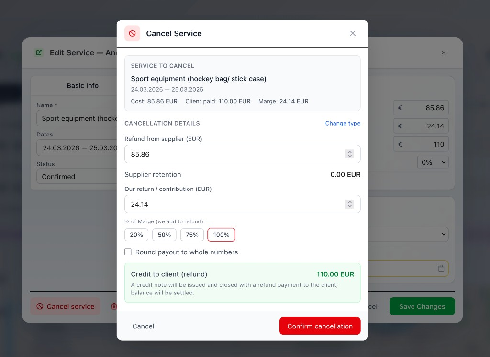

# Новости релиза — 20 марта 2026

## Отмена услуги (обязательный релиз)

Модальное окно отмены услуги: сводка (стоимость, оплата клиента, маржа), **Детали отмены** (возврат от поставщика, наша доля, % маржи 20/50/75/100%), кредит клиенту и кредит-нота. Подтверждение отмены в один шаг.

---

## Восстановить исходный для отменённых услуг

Для услуг типа «Cancellation» нельзя отменить повторно — только **Восстановить исходный**. Один клик восстанавливает исходную услугу и удаляет запись об отмене.

*(Добавить реальный скриншот: `restore-to-original.png`)*

---

## Компанейские расходы (Finance)

Новая вкладка **Company expenses** в Finance для учёта расходов компании (коммунальные, страховые и т.п.), не связанных с заказами. Загрузка PDF/изображений с AI-распознаванием, фильтры по периоду, поставщику и сумме. Только для Supervisor и Finance.

*(Добавить реальный скриншот: `company-expenses.png`)*

---

## Слияние контактов с превью и массовое слияние

Перед слиянием показываются обе карточки, чекбокс подтверждения и предупреждение о необратимости. **Массовое слияние**: выбор нескольких контактов чекбоксами и слияние в целевой одним действием.

*(Добавить реальный скриншот: `merge-preview.png`)*

---

## Аватар Lead Passenger в заголовке заказа

В заголовке заказа отображается аватар Lead Passenger рядом с именем.

*(Добавить реальный скриншот: `order-header-avatar.png`)*

---

## Счета и услуги

- **Номер кредит-счёта** — формат `оригинал-C` (напр. INV-001 → INV-001-C)
- **Резервирование номера** — номера резервируются только при сохранении, а не при открытии диалога создания
- **Описания услуг** — переводятся на язык счёта в PDF
- **Поставщик** — виден в отменённых услугах (берётся из родительской при отсутствии)

---

## Исправления

- Дата рождения в паспорте сохраняется корректно; слияние синхронизирует имя клиента в заказе
- AI-парсинг паспорта: поддержка UK/PDF, MRZ fallback, повышенная надёжность

---

*Используйте реальные скриншоты из приложения. См. `SCREENSHOTS_GUIDE.md`.*
